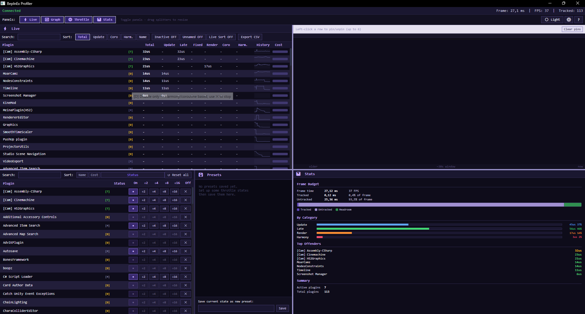
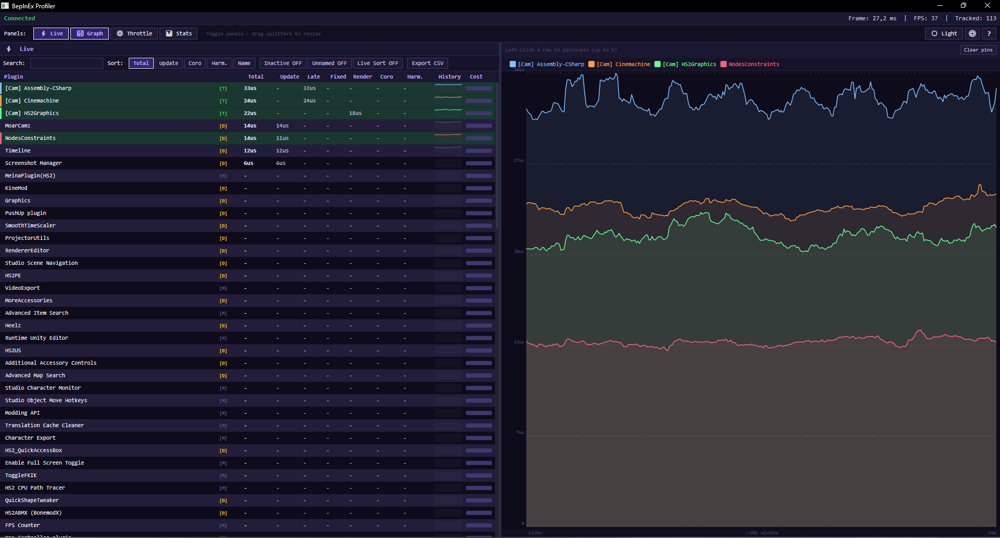
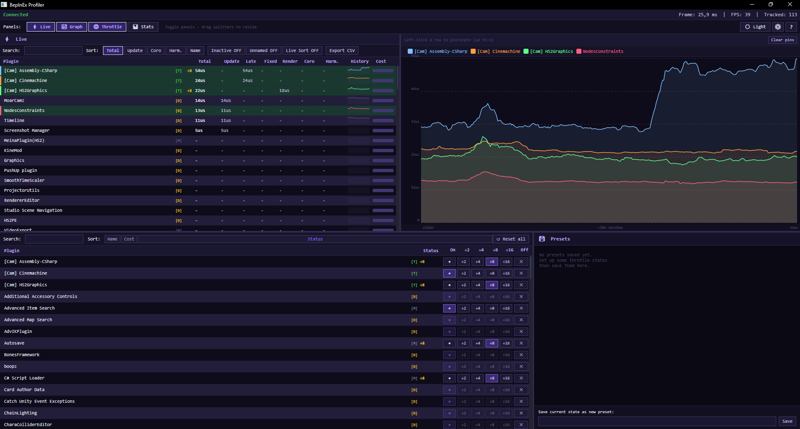
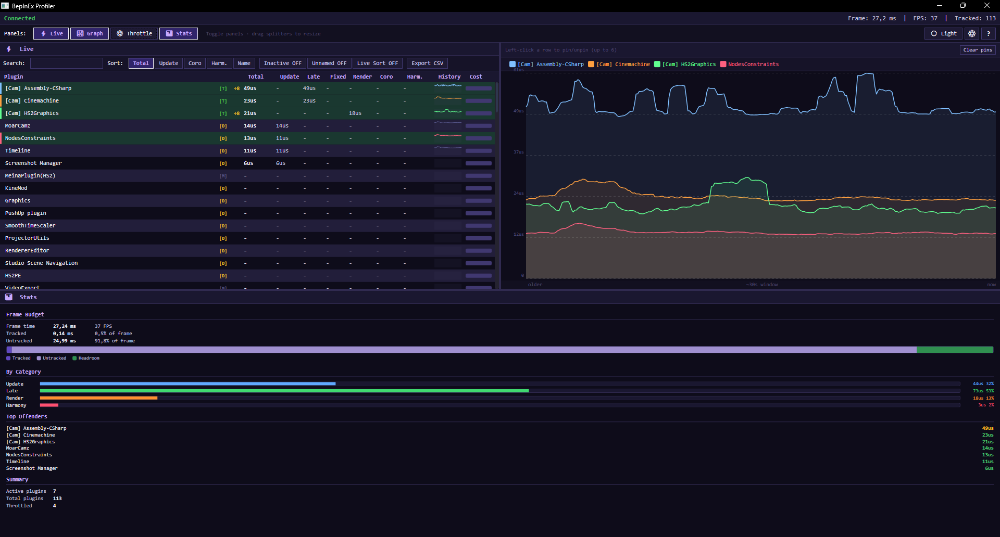
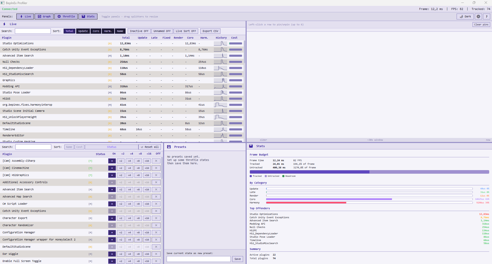
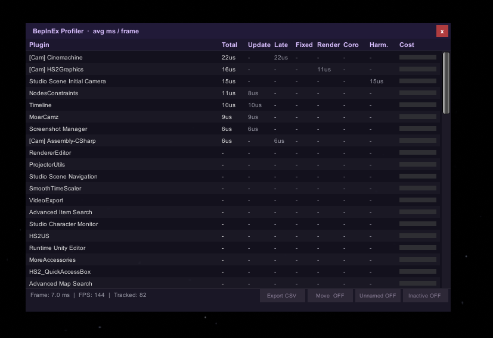

# BepInEx Profiler

Are you a stats-nerd? That's cool, me too.

Per-plugin frame-time profiler for HoneySelect 2 and other BepInEx games, with a companion app for throttling plugins at runtime.
Made by Sly aka Kumiho -- **v0.3.0 beta**

In active development, so expect updating this thing a lot.

> **Beta.** Works well in testing but there are probably edge cases I haven't hit yet. If something breaks, open an issue and attach your `BepInExProfiler_log.txt`.

---

## Screenshots



*All four panels open at once -- Live, Throttle, and Stats*



*Live list with four plugins pinned to the graph*



*Throttle panel with frame-skip active on several plugins*



*Stats panel -- frame budget, category breakdown, top offenders*



*Live panel sorted by cost with real plugin data, light mode*



*The in-game overlay (Ctrl+P) works without the companion app*

---

## What it does

Shows you exactly which of your installed plugins are eating frame time -- broken down by Update, LateUpdate, FixedUpdate, Render, Coroutines, and Harmony patch overhead. More importantly, it lets you throttle or disable individual plugins live without touching anything on disk or restarting the game.

The tool is split into two parts:

**The plugin (`BepInExProfiler.dll`)** runs inside the game. On its own you get a basic IMGUI overlay (Ctrl+P to toggle) that lists plugin costs, plus hotkeys for moving it and exporting to CSV. All the configuration lives in the BepInEx F1 menu under `[BepInEx Profiler]`.

**The companion app (`ProfilerApp.exe`)** is where the actual usability is. It connects to the plugin over a local pipe and gives you:
- A live sortable table with sparkline history and per-category cost columns
- A graph panel you can pin specific plugins to
- A throttle panel with per-plugin ÷2/÷4/÷8/÷16 frame-skip controls, full disable, and saveable presets
- A stats panel with frame budget breakdown and top offenders

If you're just curious which plugin is killing your FPS, the in-game overlay is fine. If you actually want to do something about it, you need the companion app.

---

## About the .exe

I know. An `.exe` from a random modder is a red flag. Here's what it actually is: a WPF desktop app that reads data from the game over a named pipe and draws a window. That's it.

It doesn't make any network connections, doesn't write anywhere outside `Documents\BepInExProfiler\`, doesn't touch the registry, doesn't inject into anything. You can verify this yourself with [Process Monitor](https://learn.microsoft.com/en-us/sysinternals/downloads/procmon), [VirusTotal](https://www.virustotal.com/gui/home/upload), or [Wireshark](https://www.wireshark.org/), all of which are free tools.

The source isn't public because this is a personal project I'm not ready to open-source. That's a legitimate reason to be skeptical, and I'm not going to tell you not to be. If you'd rather not run it, the in-game overlay (Ctrl+P) works fine on its own. But you just won't have the throttle controls or the detailed panels.

---

## Compatibility

Built and tested on HoneySelect 2, but the plugin itself doesn't use anything game-specific -- it's pure BepInEx 5.x and Unity APIs. Koikatsu, AI Shoujo, and other games running BepInEx 5 on Mono should work fine. Camera component detection may behave slightly differently depending on the game's setup, but nothing should break.

If you try it on another game and run into issues, open an issue and mention which game.

---

## Requirements

- BepInEx 5.x (tested on HS2, should work on KK, KKS, AIS, and similar)
- Windows 10 or later
- .NET 4.8 for the companion app (ships with Windows 10 1903+, otherwise grab it [from Microsoft](https://dotnet.microsoft.com/en-us/download/dotnet-framework/net48))

---

## Installation

1. Grab the zip from [Releases](../../releases/latest)
2. Extract into your HS2 folder -- you want it to end up like:
   ```
   HoneySelect2/BepInEx/plugins/Kumiho/
     BepInExProfiler.dll
     ProfilerApp.exe
   ```
3. Launch the game. The companion app should open on its own.

If it doesn't open automatically, check the BepInEx F1 menu -- there's an `Auto-Launch Companion App` toggle under `[BepInEx Profiler]`. You can also just run `ProfilerApp.exe` directly from the folder.

---

## Controls

| | |
|---|---|
| **Ctrl+P** | Toggle in-game overlay |
| **Ctrl+M** | Move/resize overlay |
| **Ctrl+E** | Export snapshot to CSV |
| **F1** | BepInEx config menu (hotkeys, font size, rolling window, etc.) |

---

## Companion app

Panels are toggled with the buttons at the top. You can have all four open at once and resize them with the splitters.

**Live** -- the main plugin list. Left-click a row to pin it to the graph, right-click for a quick throttle menu. Sortable by any column.

**Graph** -- scrolling time-series for up to 6 pinned plugins.

**Throttle** -- the main reason to use this tool. Every plugin has buttons to run it at ÷2/÷4/÷8/÷16 frequency or disable it entirely. Changes take effect immediately. You can save presets if you find a combination that works well for your setup.

**Stats** -- frame budget bar, breakdown by category (Update/Render/Harmony/etc.), top 10 offenders.

Each plugin shows a capability badge:

- `[T]` -- throttleable. Frame-skip works.
- `[D]` -- Harmony/coroutine based. Throttle buttons do nothing, but you can still disable it with X.
- `[M]` -- monitor only. No hooks found, cost is tracked but can't be reduced.

The settings button (top bar) opens a panel for font size, rolling average window, and display filters.

---

## Files

| | |
|---|---|
| `Documents\BepInExProfiler\window.cfg` | Layout, theme, settings |
| `Documents\BepInExProfiler\presets.json` | Throttle presets |
| `Documents\BepInExProfiler\profiler_*.csv` | CSV exports |
| `BepInEx\plugins\Kumiho\BepInExProfiler_log.txt` | Log file -- attach this to bug reports |

---

## Known issues

- Plugins that only use Harmony patches or coroutines (`[D]`) can't be throttled, only stopped
- Camera/graphics components (like HS2Graphics) don't appear until a few seconds after entering Studio
- If a plugin misbehaves after being disabled, hit Reset all in the Throttle panel
- Companion app is Windows only

---

## Disclaimer

This tool modifies how plugins execute at runtime. While it doesn't touch any game files or save data, disabling or heavily throttling a plugin mid-session can cause unexpected behaviour -- crashes, missing functionality, broken scenes. If something goes wrong, use Reset all in the Throttle panel, or just restart the game.

Install and use at your own risk. I'm not responsible for broken saves, corrupted scenes, or any other damage to your game or setup.

---

## Bugs / feedback

Open an [issue](../../issues). Include the log file and what you were doing when it broke.
Or for small stuff, DM me on discord: sly97.

---

*Personal use only -- see [LICENSE](LICENSE). Don't redistribute.*
